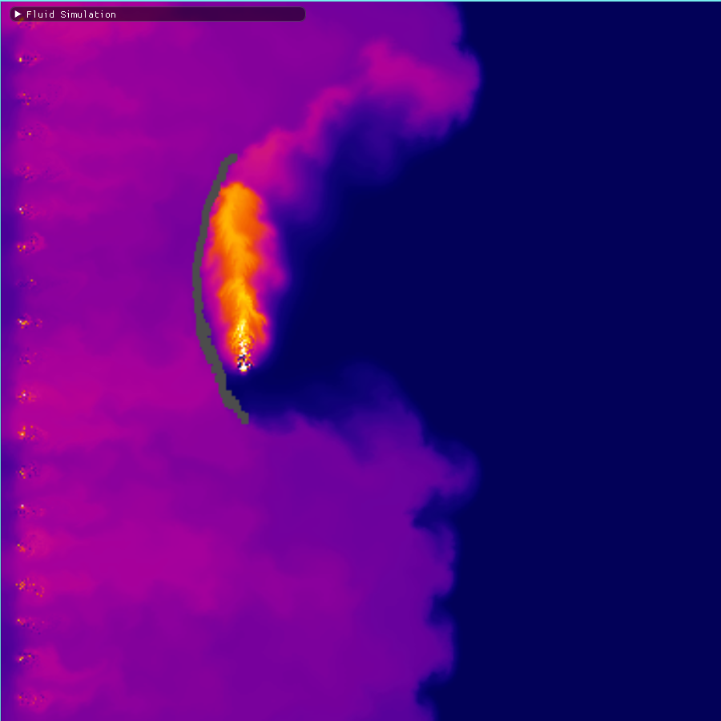
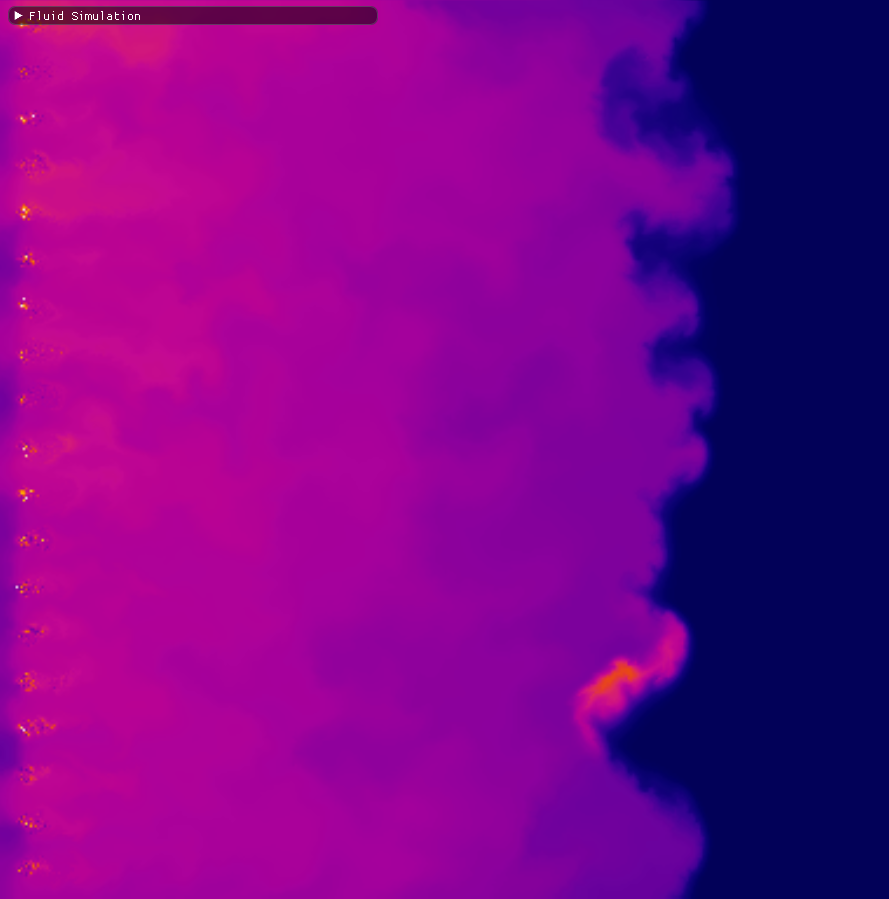
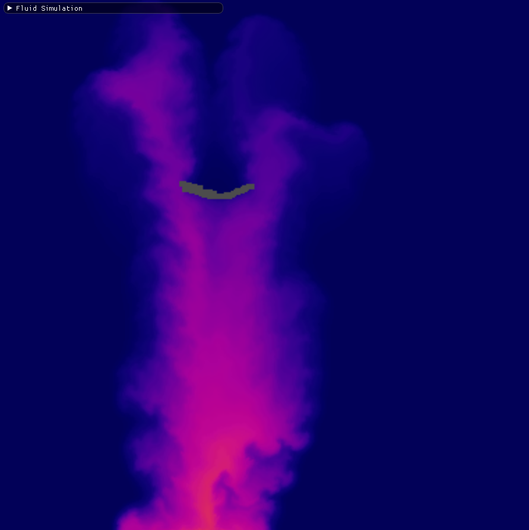
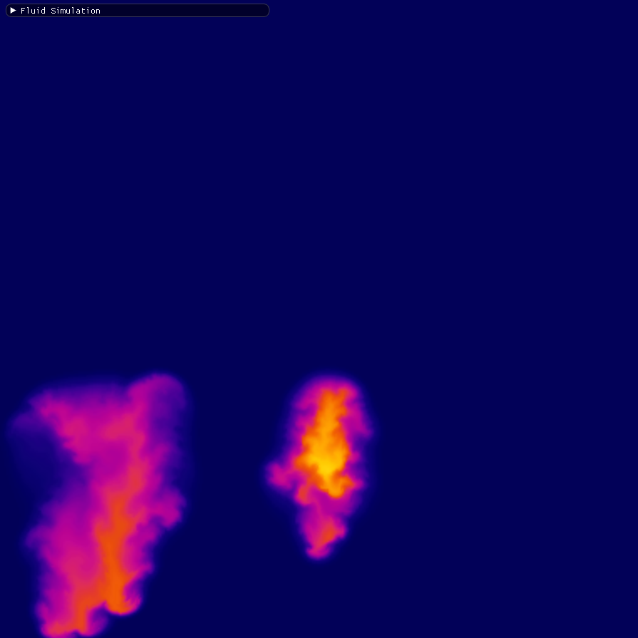
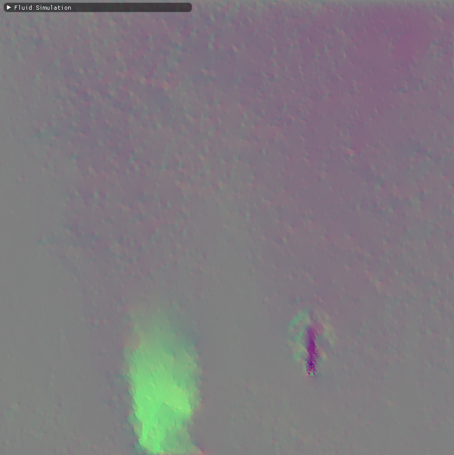

# Fluid Simulation Sandbox

2D semi-Lagrangian fluid solver based on ["Stable Fluids" solver by Jos Stam](http://www.dgp.toronto.edu/people/stam/reality/Research/pdf/GDC03.pdf "Real-Time Fluid Dynamics for Games").

Users can interact in real-time with the fluid, using various controls.
We also provide various render modes to provide users a better understanding of what is going on within the simulation.

## Features
- Real time fluid interaction.
- External forces such as gravity and buoyancy.
- Internal boundaries that you can draw.
- Vorticity confinement
- OpenMP parallel code

## Screenshots

#### Density Render Mode

#### Windtunnel Obstacle

#### Windtunnel

#### Temperature into Obstacle

#### Temperature Render Mode

#### Velocity Render Mode

## Dependencies
- SDL 2
- GLEW
- Dear Imgui
- glm

## Building the Project

Headers and lib's are included in the project and should work out of the box.
