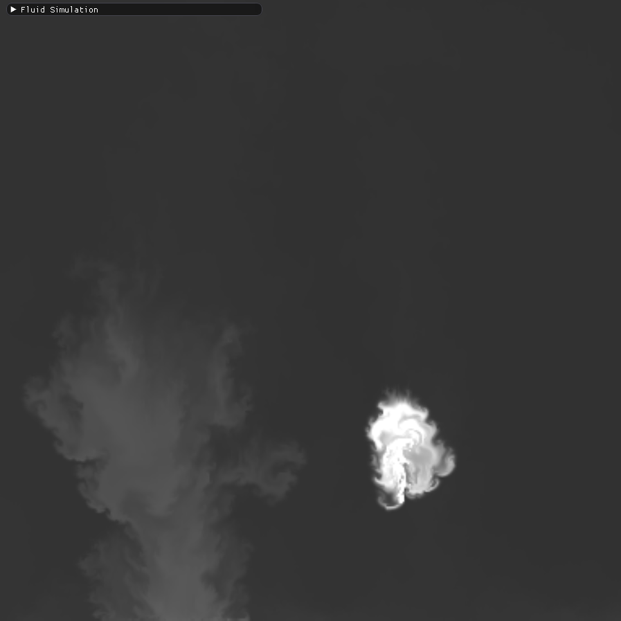

# Fluid Simulation Sandbox

2D semi-lagrangian fluid solver based on "Stable Fluids" solver by Jos Stam.

## Features
- Real time fluid interaction.
- External forces such as gravity and buoyancy.
- Internal boundaries that you can draw.
- Vorticity confinement

## Screenshots

#### Density Render Mode

#### Windtunnel Obstacle

#### Windtunnel

#### Temperature into Obstacle

#### Temperature Render Mode

#### Velocity Render Mode

## Dependencies
- SDL 2
- GLEW
- Dear Imgui
- glm

DLL's, headers and lib's are included in the project and should work out of the box.
The project uses a Visual Studio 2017 solution.

This git repository was originally hosted on Gitlab.
